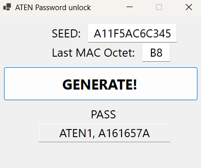

# ATEN-Calculator
This repository contains a password calculator tool designed to generate passwords for ATEN command using a combination of seed and the last octet of the router's MAC address. The tool is particularly useful for certain routers manufactured by ZyXEL and TP-LINK.
## Requirements
- Visual Studio (for building the project)
- .NET 8.0
- Windows operating system
## Usage
1. Obtain the seed and the last octet of the MAC address of your router.
2. Generate seed via ATSE command
3. Input the seed and last MAC octet into the program
4. Click Generate button
5. The tool will generate ATEN command with corresponding password.

## Building
1. Clone or download the repository to your local machine.
2. Open the project in Visual Studio.
3. Build the project to generate the executable file.

## Executable
You can directly download the compiled executable from the Releases section.
